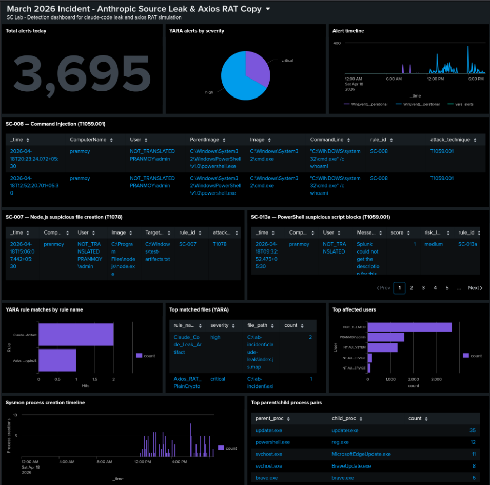
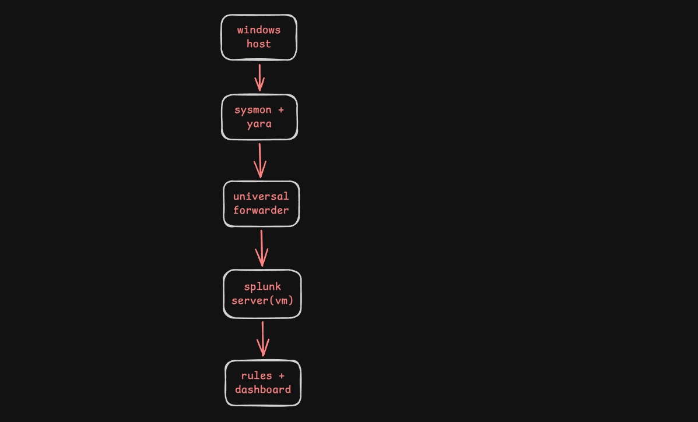

# Splunk SIEM Lab: Anthropic Source Leak & Axios RAT Detection

**A complete detection engineering lab simulating the March 2026 Anthropic Claude Code source leak and compromised axios supply chain attack.**

---

## 📋 Overview

This project implements an end-to-end security detection pipeline using Splunk Enterprise as the SIEM. The lab simulates two real-world supply chain incidents from March 31, 2026:

| Threat | Description | MITRE Technique |
|--------|-------------|-----------------|
| **Anthropic Source Leak** | Misconfigured source map exposed 512k lines of Claude Code internal source | T1530, T1078 |
| **Axios RAT** | Compromised npm package `axios` with `plain-crypto-js` RAT exfiltrating env variables | T1195.001, T1059.001 |

### Key Accomplishments

- ✅ **8 detection rules** deployed (4 Sigma→SPL, 3 YARA) with 100% trigger rate
- ✅ **Risk-scoring PowerShell detection** overcoming Windows event splitting limitations
- ✅ **Automated YARA scanner** in Python running on 30-minute intervals
- ✅ **9-panel Splunk dashboard** for incident visualization
- ✅ **Complete documentation** including challenges, gaps, and future improvements

---

## Dashboard

---

## Flow

---

## 🏗️ Lab Architecture
┌─────────────────────────────────────────────────────────────────┐
│ Windows Host (Endpoint) │
│ ┌──────────┐ ┌──────────┐ ┌──────────┐ ┌──────────────────┐ │
│ │ Sysmon │ │PowerShell│ │ Security │ │ YARA Scanner │ │
│ │Event IDs │ │Event 4104│ │ Event │ │ (Python/sched) │ │
│ │1,3,11,13 │ │ │ │ Logs │ │ │ │
│ └────┬─────┘ └────┬─────┘ └────┬─────┘ └────────┬─────────┘ │
│ └─────────────┴─────────────┴─────────────────┘ │
│ │ │
│ Splunk Universal Forwarder │
│ │ (port 9997) │
└──────────────────────────────┼───────────────────────────────────┘
│
▼
┌─────────────────────────────────────────────────────────────────┐
│ Ubuntu VM (Splunk Enterprise) │
│ │ │
│ ┌─────────────────────────────────────────────────────────┐ │
│ │ Index: main │ │
│ └─────────────────────────────────────────────────────────┘ │
│ │ │
│ ┌──────────────┐ ┌──────────────┐ ┌──────────────────────┐ │
│ │ Sigma Rules │ │ YARA Events │ │ 9-Panel Dashboard │ │
│ │ (SPL alerts) │ │ (parsed) │ │ (Splunk Classic XML) │ │
│ └──────────────┘ └──────────────┘ └──────────────────────┘ │
└─────────────────────────────────────────────────────────────────┘

---

## 📁 Repository Structure
splunk-anthropic-lab/
│
├── README.md # This file
├── report/
│   └── README.md # This file
│
├── rules/
│ ├── splunk/ # Original Sigma rules (.spl)
│ │ ├── sc-008.spl
│ │ ├── sc-007.spl
│ │ ├── sc-013a.spl
│ │ └── sc-004a.spl
│ │
│ ├── sigma/ # Converted SPL queries (.yml)
│ │ ├── sc-008.yml
│ │ ├── sc-007.yml
│ │ ├── sc-013a.yml
│ │ └── sc-004a.yml
│ │
│ └── yara/ # YARA detection rules (.yar)
│ ├── claude_leak.yar
│ ├── axios_rat.yar
│ └── kairos_daemon.yar
│
├── scripts/
│ └── yara_scanner.py # Automated YARA scanner (30-min intervals)
│
├── screenshots/ # Dashboard and alert images
│ ├── dashboard_main.png
│ ├── sc-008_alert.png
│ ├── sc-013a_risk_scoring.png
│ └── yara_matches.png
│
└── lab_setup/
└── inputs.conf # Splunk Universal Forwarder config

---

## 🛠️ Detection Rules Summary

### Sigma Rules (Converted to SPL)

| Rule ID | Detection Logic | MITRE | Severity |
|---------|-----------------|-------|----------|
| **SC-008** | `powershell.exe` → `cmd.exe /c whoami` | T1059.001 | High |
| **SC-007** | `node.exe` writing files with `../` path traversal | T1078 | High |
| **SC-013a** | Risk-scoring for `eval`, `require`, `process.env`, `dump` | T1059.001 | Medium-High |
| **SC-004a** | `KAIROS` or `daemon` with `claude` in command line | T1569 | Critical |

### YARA Rules

| Rule Name | Detection Target | Severity |
|-----------|------------------|----------|
| `Claude_Code_Leak_Artifact` | `.claude/settings.local.json`, `dangerouslySkipPermissions`, `@anthropic-ai/claude-code` | High |
| `Axios_RAT_PlainCryptoJS` | `plain-crypto-js`, `eval(process.env`, `dump(process.env` | Critical |
| `Claude_KAIROS_Daemon_Mode` | `KAIROS_ENABLED`, `daemon_mode` | Medium |

---

## Skills Demonstrated

- SIEM Engineering
- Detection Engineering
- Threat Hunting
- MITRE ATT&CK Mapping
- YARA Rule Writing

---

## 📈 MITRE ATT&CK Coverage

| Tactic          | Technique                                           | Rule              |
|-----------------|-----------------------------------------------------|-------------------|
| Execution       | T1059.001 - Command & Scripting Interpreter         | SC-008, SC-013a  |
| Defense Evasion | T1078 - Valid Accounts Abuse                        | SC-007           |
| Initial Access  | T1195.001 - Compromise Software Dependencies        | YARA (axios-rat) |
| Collection      | T1530 - Data from Information Repositories          | YARA (claude-leak) |
| Execution       | T1569 - System Services                             | SC-004a          |

---

## 📝 Lessons Learned
PowerShell script blocks split across events → AND logic fails. Risk scoring with graduated severity is more robust.

Splunk Universal Forwarder sourcetypes can drop after restart → Always ensure file-based inputs have at least one entry before restarting.

Sigma CLI installation on Linux Lite → Requires pipx inject sigma-cli pySigma-backend-splunk due to externally-managed Python environment.

YARA syntax is strict → No inline // comments in meta section; all string variables must be referenced in condition.

Sysmon EventCode 1 requires explicit configuration → Default config doesn't capture all process creation events.

---

## 🙏 Acknowledgments
Splunk for the free Enterprise trial license (50GB/day)

SigmaHQ for the Sigma rule specification

VirusTotal for YARA

MITRE ATT&CK for the framework

---

## Author

Pranmoy  
Cybersecurity Lab Project

## 📧 Contact
[Pranmoy] — [https://www.linkedin.com/in/pranmoy-patar-b99a142b3/]